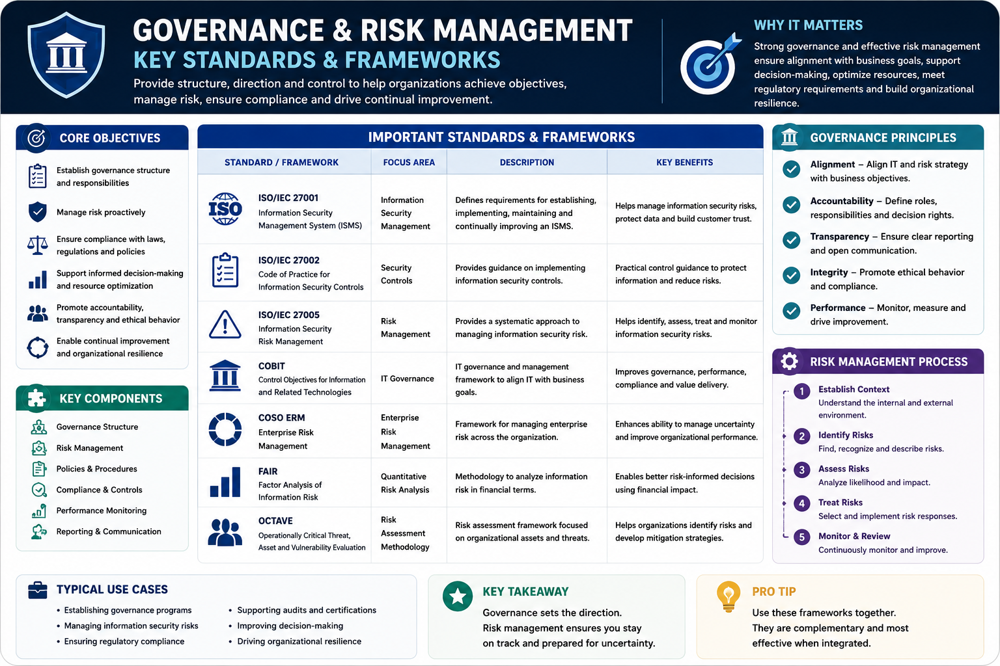
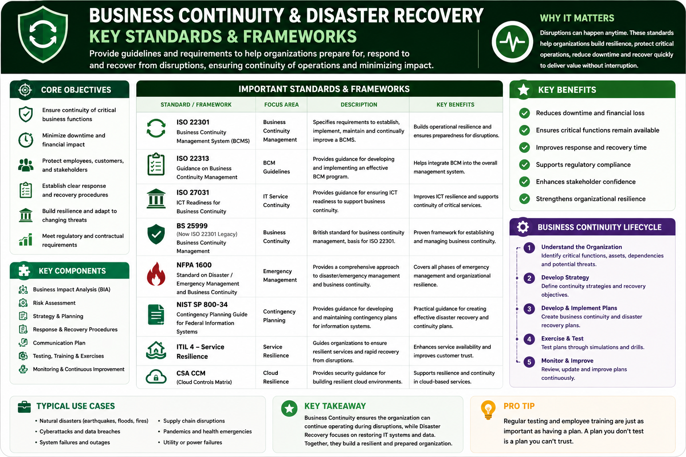
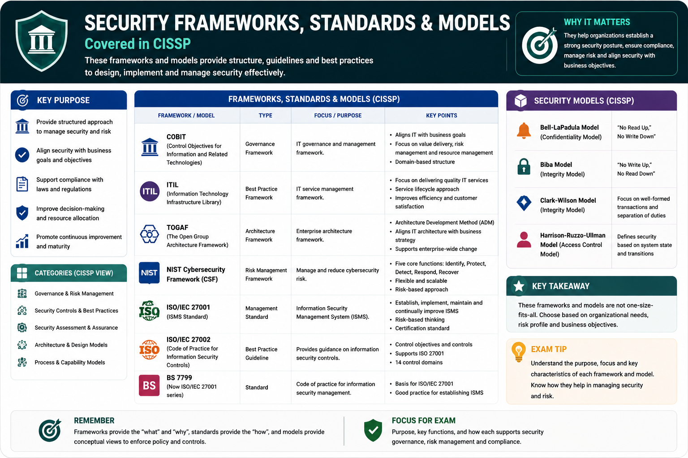
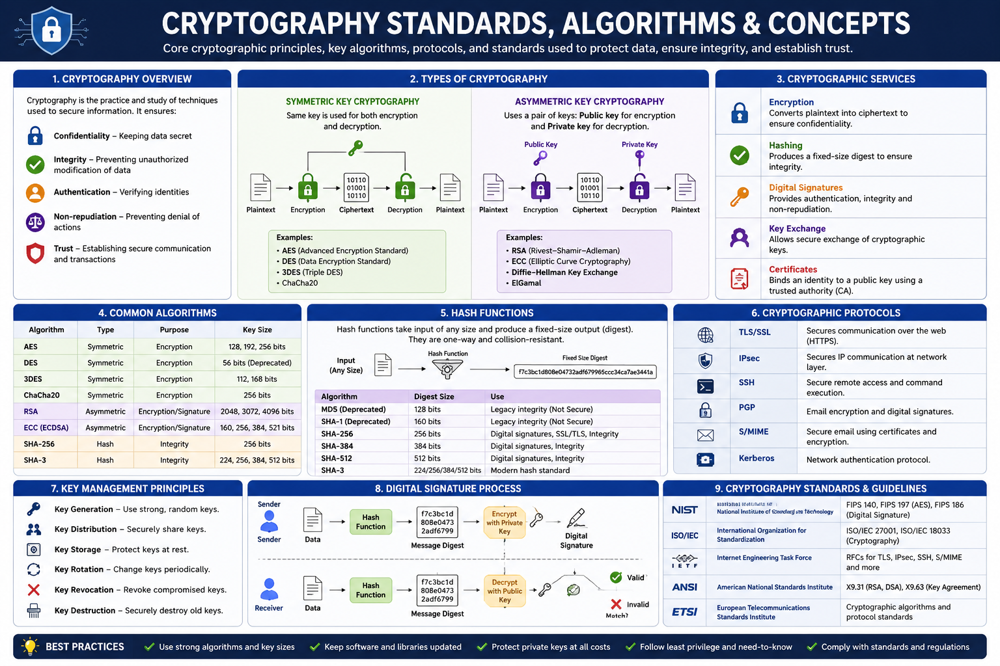
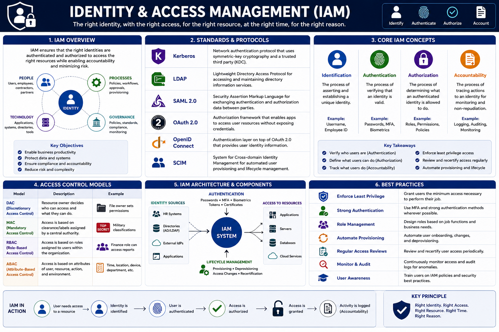
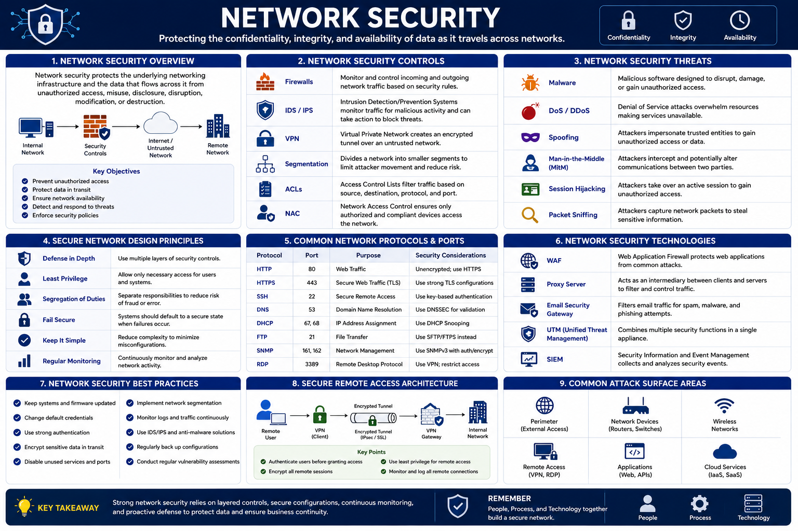
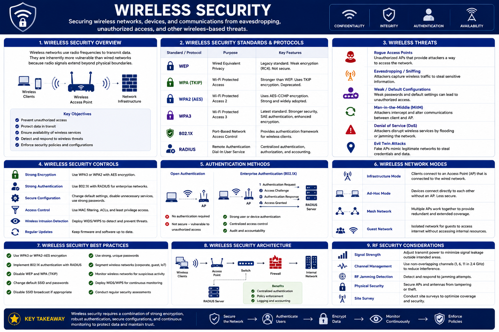
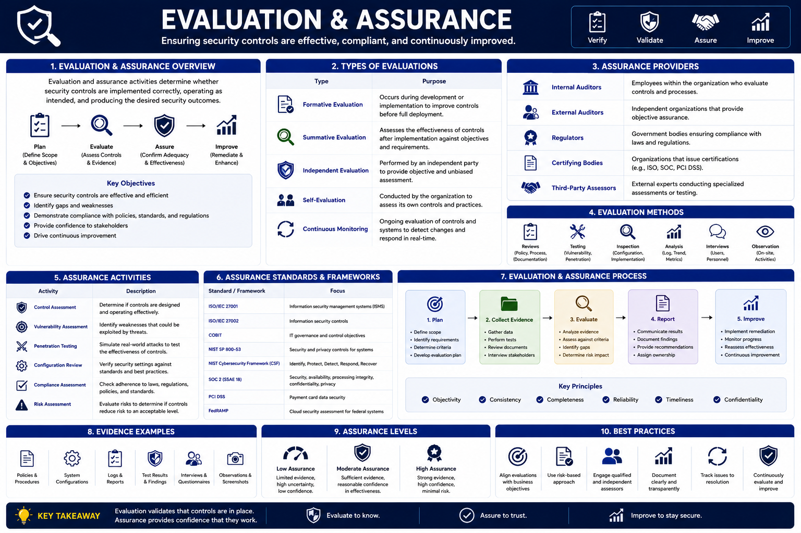
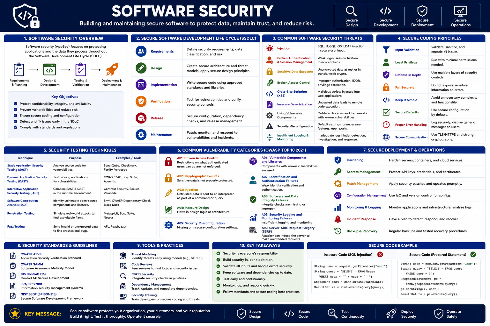
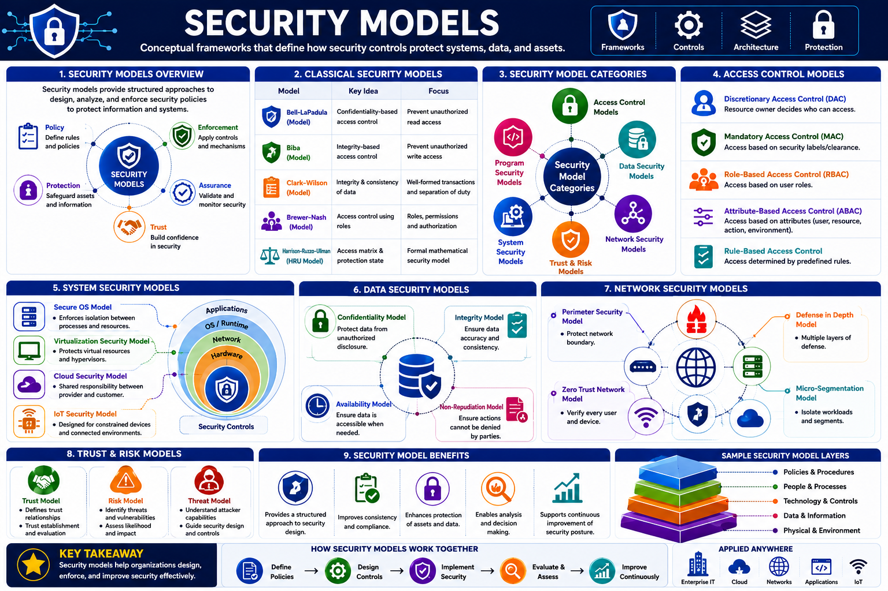

# Security Standards, Frameworks & Models

A visual reference library covering enterprise security standards, frameworks, protocols, maturity models, and security models commonly used in governance, risk management, architecture, compliance, and security engineering.

## Repository Contents

- Governance & Risk Management
- Business Continuity & Disaster Recovery
- Security Frameworks
- Cryptography Standards
- Identity & Access Management
- Network Security
- Wireless Security
- Evaluation & Assurance
- Software Security
- Security Models

---

## Governance & Risk Management

Governance and risk management establish the foundation of an organization's security program. These frameworks help align security initiatives with business objectives, manage risk, support compliance efforts, and improve decision-making.

Key topics covered:
- Information Security Governance
- Risk Assessment and Treatment
- Enterprise Risk Management
- Control Frameworks
- Quantitative and Qualitative Risk Analysis

---

## Business Continuity & Disaster Recovery

Business Continuity and Disaster Recovery ensure that organizations can maintain critical operations during disruptive events and recover essential systems and services within acceptable timeframes. Effective continuity planning reduces operational, financial, and reputational impact while supporting organizational resilience.

This section covers industry-recognized standards, frameworks, and concepts used to prepare for, respond to, and recover from incidents ranging from cyberattacks and system failures to natural disasters and large-scale business disruptions.

Key topics include:

* Business Impact Analysis (BIA)
* Recovery Time Objective (RTO)
* Recovery Point Objective (RPO)
* Business Continuity Planning (BCP)
* Disaster Recovery Planning (DRP)
* Crisis Management
* Resilience and Operational Recovery

These concepts help organizations identify critical business functions, prioritize recovery efforts, minimize downtime, and maintain the availability of essential services during adverse conditions.

---

## Security Frameworks
Security frameworks provide structured approaches for managing cybersecurity risks, implementing security controls, and improving organizational security posture. They help organizations establish consistent practices, measure maturity, support compliance efforts, and align security initiatives with business objectives.

This section covers widely adopted frameworks and control catalogs used across public and private sectors to guide security governance, risk management, control implementation, and continuous improvement activities.

Key topics include:

* Cybersecurity Governance
* Security Control Frameworks
* Risk Management Frameworks
* Compliance and Regulatory Alignment
* Security Program Development
* Continuous Monitoring and Improvement

Common frameworks provide organizations with a repeatable methodology for identifying risks, protecting assets, detecting threats, responding to incidents, and recovering from disruptions. These frameworks serve as the foundation for building mature, scalable, and effective cybersecurity programs.

---

## Cryptography Standards
Cryptography provides the foundation for protecting sensitive information by ensuring confidentiality, integrity, authenticity, and non-repudiation. It enables secure communication, protects data at rest and in transit, and supports trusted digital interactions across modern enterprise environments.

This section covers the core cryptographic standards, algorithms, protocols, and concepts used to secure systems, applications, networks, and digital identities. Understanding these technologies is essential for implementing effective security controls and managing cryptographic risk.

Key topics include:

* Symmetric Encryption
* Asymmetric Encryption
* Hashing Algorithms
* Digital Signatures
* Public Key Infrastructure (PKI)
* Certificate Management
* Key Management and Distribution
* Cryptographic Standards and Protocols

Cryptography plays a critical role in securing communications, validating identities, protecting sensitive data, and establishing trust between systems, users, and organizations in both traditional and cloud environments.

---

## Identity & Access Management
Identity and Access Management (IAM) enables organizations to control who can access systems, applications, data, and resources while ensuring that access is granted according to business and security requirements. Effective IAM reduces risk, supports compliance objectives, and enforces the principle of least privilege across enterprise environments.

This section covers the standards, protocols, models, and processes used to manage digital identities, authenticate users, authorize access, and maintain accountability throughout the identity lifecycle.

Key topics include:

* Identification and Authentication
* Authorization and Access Control
* Federation and Single Sign-On (SSO)
* Identity Lifecycle Management
* Privileged Access Management (PAM)
* Access Control Models (DAC, MAC, RBAC, ABAC)
* Identity Provisioning and Deprovisioning
* Authentication and Federation Protocols

Identity management serves as a critical security foundation by ensuring that the right individuals have the appropriate level of access to the right resources at the right time while maintaining visibility, accountability, and control over enterprise identities.

---

## Network Security
Network security focuses on protecting data, systems, and communications as they traverse enterprise networks. It encompasses the technologies, architectures, protocols, and controls used to secure network infrastructure, manage traffic flows, prevent unauthorized access, and defend against internal and external threats.

This section covers the foundational concepts and security mechanisms used to design, operate, and protect modern network environments, including on-premises, cloud, and hybrid infrastructures.

Key topics include:

* Network Architecture and Design
* Defense-in-Depth
* Secure Network Protocols
* Network Segmentation and Isolation
* Firewalls and Security Gateways
* Virtual Private Networks (VPNs)
* Intrusion Detection and Prevention
* Network Monitoring and Traffic Analysis
* Network Access Control (NAC)

Strong network security enables organizations to maintain confidentiality, integrity, and availability while reducing the attack surface, limiting lateral movement, and providing visibility into network activity across enterprise environments.

---

## Wireless Security

Wireless security focuses on protecting wireless communications, devices, and network infrastructure from unauthorized access, interception, and attacks. As organizations increasingly rely on wireless connectivity, securing wireless environments has become essential to maintaining confidentiality, integrity, and availability.

This section covers the standards, protocols, authentication mechanisms, and security controls used to protect wireless networks in enterprise, commercial, and public environments.

Key topics include:

* Wireless Networking Standards
* Wireless Encryption Protocols
* Authentication and Access Control
* Wireless Network Architecture
* Secure Wireless Deployment
* Rogue Access Point Detection
* Wireless Threats and Attacks
* Wireless Monitoring and Management

Effective wireless security helps organizations safeguard data transmitted over the air, prevent unauthorized network access, reduce exposure to wireless attacks, and maintain secure connectivity for users, devices, and business operations.

---

## Evaluation & Assurance
Evaluation and assurance provide confidence that security controls, systems, products, and processes operate as intended and meet defined security requirements. These concepts help organizations assess the effectiveness of security implementations, validate compliance objectives, and establish trust in technology solutions.

This section covers the standards, evaluation criteria, assurance models, and certification frameworks used to measure and verify the security capabilities of systems, applications, and products throughout their lifecycle.

Key topics include:

* Security Evaluation Criteria
* Assurance Levels and Ratings
* Certification and Accreditation
* Security Testing and Validation
* Trusted Computing Concepts
* Product Security Assessments
* Security Assurance Frameworks
* Independent Verification and Validation

Evaluation and assurance activities help organizations make informed decisions about technology adoption, reduce uncertainty, demonstrate compliance, and ensure that security controls provide the level of protection required to support business and operational objectives.

---

## Software Security
Software security focuses on integrating security throughout the software development lifecycle to reduce vulnerabilities, protect applications, and ensure that software systems operate securely in production environments. As applications increasingly drive business operations, secure development practices have become a critical component of organizational cybersecurity programs.

This section covers the standards, frameworks, methodologies, and best practices used to design, develop, test, deploy, and maintain secure software. It emphasizes the importance of building security into applications from the earliest stages of development rather than attempting to add security after deployment.

Key topics include:

* Secure Software Development Lifecycle (SSDLC)
* Secure Coding Practices
* Threat Modeling
* Security Testing and Validation
* Vulnerability Management
* Application Security Frameworks
* Software Assurance and Maturity Models
* DevSecOps and Continuous Security Integration

Effective software security reduces the likelihood of exploitable vulnerabilities, strengthens application resilience, supports regulatory compliance, and helps organizations deliver secure and reliable software solutions throughout the development lifecycle.

---

## Security Models
Security models provide formal frameworks for defining, enforcing, and evaluating security policies within information systems. They establish the rules governing how subjects interact with objects, helping organizations maintain confidentiality, integrity, and availability across computing environments.

This section covers foundational security models that have influenced modern access control systems, operating system design, and enterprise security architectures. These models provide structured approaches for managing access rights, protecting sensitive information, and preventing unauthorized actions.

Key topics include:

* Confidentiality Models
* Integrity Models
* Access Control Models
* Information Flow Control
* Separation of Duties
* Conflict of Interest Prevention
* Authorization and Rights Management
* Trusted System Design

Security models help organizations translate security policies into enforceable controls, providing a theoretical foundation for access management, data protection, and system security. Many modern security architectures continue to incorporate principles derived from these foundational models to support secure and trustworthy computing environments.

---

## Disclaimer

This repository is intended as a professional reference and knowledge resource. Standards, frameworks, protocols, and models remain the intellectual property of their respective organizations and standards bodies.
